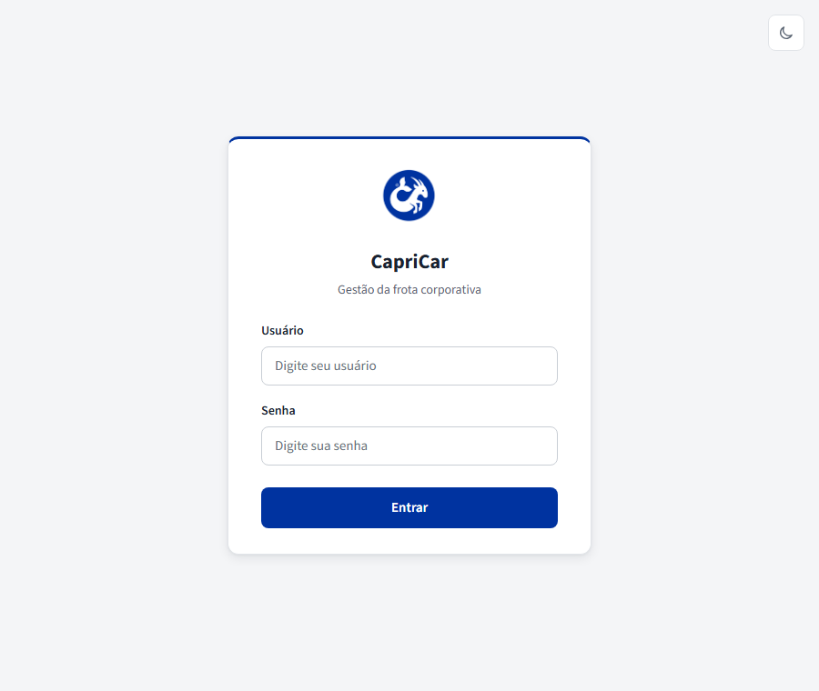

# CapriCar

Sistema interno de reserva e gestão da frota corporativa da Capricórnio
Têxtil: veículos, locais, motoristas (com CNH validada), retirada/devolução
com checklist fotográfico, manutenção preventiva, integrações (Microsoft
Entra ID e calendário do Outlook) e relatórios — tudo em um só lugar, sem
depender de planilha ou grupo de WhatsApp para saber qual carro está livre.

> Uso interno da Capricórnio Têxtil. Backend em Node.js/Express +
> PostgreSQL; frontend em HTML/CSS/JavaScript puro (sem framework de build).



## Funcionalidades principais

| Área | O que faz |
|---|---|
| **Reservas** | Criação em duas etapas (trajeto/veículo/período, depois motivo/passageiros), recomendação automática do veículo mais disponível, aviso de rodízio de placas, edição/cancelamento pelo criador antes da retirada |
| **Motorista e CNH** | A CNH não é digitada: é importada da **e-CNH** (PDF da Carteira Digital de Trânsito), com verificação de assinatura digital do DETRAN. Reserva nova sempre exige um motorista cadastrado com CNH válida e compatível com a capacidade do veículo |
| **Caronas** | Entrar como passageiro em reserva de outra pessoa, com controle de capacidade e monitoramento de vaga ("aguardar carona") |
| **Retirada e devolução** | Checklist com fotos do veículo, quilometragem, combustível e avarias na saída e na volta; divergência de odômetro gera notificação |
| **Locais, veículos, bloqueios e manutenção** | Cadastro de filiais e frota, bloqueio de veículo por período (manutenção, sinistro etc.) e lembretes preventivos por km e/ou data |
| **Grupos e veículos restritos** | Veículos que só um grupo de usuários (ex.: uma equipe técnica) pode enxergar e reservar como motorista |
| **Painel de Gestão** | Permissões granulares por pessoa (reservas, locais, frota, manutenção, bloqueios, relatórios, auditoria, regras, usuários, grupos, integrações, checklist); reserva em nome de outra pessoa; relatórios e indicadores da frota; log de auditoria completo |
| **Notificações e e-mail** | Sino de notificações no app e, quando configurado, lembretes por e-mail (reserva se aproximando, CNH e manutenção vencendo) |
| **Integrações** | Login via Microsoft Entra ID (SSO), sincronização de reservas com o calendário do Outlook e envio de e-mail via SMTP — tudo configurável pela própria interface, sem precisar mexer em arquivo |

Veja a lista completa, com regras de negócio e telas, no
[Manual de Utilização](docs/MANUAL_UTILIZACAO.md) e na
[Documentação Técnica](docs/DOCUMENTACAO_TECNICA.md).

## Stack

| Camada | Tecnologia |
|---|---|
| Backend | Node.js + Express 5 |
| Banco de dados | PostgreSQL (via `pg`), migrações em `db/migrations/` |
| Frontend | HTML/CSS/JavaScript sem framework, servido estático pelo próprio Express |
| CNH (e-CNH) | Leitura do PDF com `pdfjs-dist` + OCR local (`tesseract.js`), validação de assinatura digital ICP-Brasil |
| E-mail | `nodemailer` (SMTP) |
| SSO / Calendário | Microsoft Entra ID + Microsoft Graph (`@azure/msal-node`) |
| Testes | `node:test` (nativo do Node, sem dependência extra) |

## Pré-requisitos

- [Node.js 20+](https://nodejs.org/)
- [PostgreSQL](https://www.postgresql.org/download/) acessível pela rede (local ou em outra máquina)
- Git

## Início rápido

1. **Clone e instale as dependências:**
   ```powershell
   git clone <url-do-repositorio>
   cd CapriCar
   npm install
   ```
2. **Configure o ambiente:**
   ```powershell
   copy .env.example .env
   ```
   Edite o `.env`: aponte `PGHOST`/`PGDATABASE`/`PGUSER`/`PGPASSWORD` para o
   seu PostgreSQL e defina `ADMIN_INITIAL_PASSWORD` com **8 a 128
   caracteres** — é a senha usada na próxima etapa para criar o usuário
   `admin`. Uma senha fora desse tamanho faz o `db:seed` falhar e o `admin`
   **não é criado** (ver
   [Solução de problemas](docs/DOCUMENTACAO_TECNICA.md#17-solução-de-problemas)).
3. **Crie o banco e o usuário `admin`:**
   ```powershell
   npm run db:migrate
   npm run db:seed
   ```
4. **Suba o servidor:**
   ```powershell
   npm start
   ```
5. Acesse **http://localhost:3000** e entre com `admin` e a senha definida em
   `ADMIN_INITIAL_PASSWORD`.

Pronto para desenvolvimento contínuo: `npm run dev` reinicia o servidor
automaticamente a cada alteração em `server/`.

## Docker

Sobe a aplicação e o PostgreSQL juntos, sem precisar instalar Node ou Postgres na máquina:

```powershell
copy .env.example .env
# edite o .env: defina PGPASSWORD e ADMIN_INITIAL_PASSWORD (8 a 128
# caracteres - senha curta faz a criação do admin falhar em silêncio,
# ver nota acima) antes de continuar
docker compose up --build
```

A aplicação fica disponível em `http://localhost:3000`. Na primeira subida, o
container aplica as migrações e cria o usuário `admin` automaticamente (ver
`docker/entrypoint.sh`) - não precisa rodar `db:migrate`/`db:seed` à parte.

Fotos de retirada/devolução e os dados do Postgres ficam em volumes
Docker nomeados (`capricar_uploads`, `capricar_pgdata`), então sobrevivem a
`docker compose down` (mas não a `docker compose down -v`, que apaga os
volumes). Para reconstruir a imagem depois de alterar código:

```powershell
docker compose up --build
```

Para parar:

```powershell
docker compose down
```

## Documentação

- [Manual de utilização](docs/MANUAL_UTILIZACAO.md) — telas, funcionalidades e dúvidas comuns, para quem usa o sistema no dia a dia
- [Documentação técnica e operacional](docs/DOCUMENTACAO_TECNICA.md) — arquitetura, permissões, regras de negócio, variáveis de ambiente, API e solução de problemas
- [Backup e restauração](BACKUP.md)
- [Transferência para outro computador](INSTRUCOES_TRANSFERENCIA.md)

## Testes

```powershell
npm test
```

Testes automatizados de backend (`node:test`, sem dependência extra), cobrindo
regras de negócio, permissões, validações e integrações. `npm run test:integration`
roda um teste adicional contra a API e o banco de dados reais.

Lint:

```powershell
npm run lint
```
