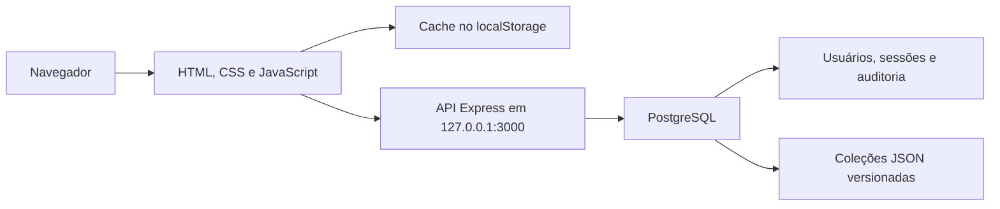
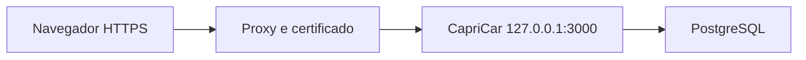

# CapriCar — Documentação Técnica e Operacional

Última revisão: 08/09/2026

Versão documentada: 1.0.0

## 1. Visão geral

O CapriCar é um sistema interno para gestão e reserva de veículos corporativos.
Ele centraliza:

- reservas de veículos por local, data e horário, com recomendação automática
  de veículo e verificação da categoria de CNH antes de avançar de etapa;
- participação de passageiros em caronas, incluindo monitoramento de rota
  ("aguardar carona") com notificação quando uma reserva compatível aparece;
- cadastro de locais e veículos (tipo, capacidade, placa, centro de custo,
  odômetro atual);
- bloqueios por manutenção, revisão, documentação ou indisponibilidade;
- lembretes de manutenção preventiva por quilometragem e/ou data;
- retirada e devolução com quilometragem, combustível, condição de limpeza,
  fotos e avarias — com confirmação (em vez de bloqueio) quando a
  quilometragem informada é menor que a esperada;
- CNH dos motoristas ("Meu perfil"), com validade e categoria mínima exigida
  por veículo;
- usuários, perfis e permissões granulares, com login local ou via Microsoft
  Entra ID (SSO);
- notificações internas e por e-mail (reservas, avarias, CNH vencendo,
  manutenção, divergência de odômetro) e sincronização opcional com a agenda
  do Outlook;
- regras configuráveis de reserva;
- auditoria das ações realizadas;
- relatórios em tela, indicadores da frota, Excel e PDF.

O sistema foi desenvolvido como uma aplicação web responsiva, com interface em
HTML, CSS e JavaScript, servidor Node.js/Express e banco PostgreSQL.

## 2. Tecnologias

| Camada | Tecnologia |
|---|---|
| Interface | HTML5, CSS3 e JavaScript sem framework |
| Servidor | Node.js e Express 5 |
| Banco de dados | PostgreSQL |
| Driver PostgreSQL | `pg` |
| Configuração | `dotenv` e arquivo `.env` |
| Autenticação | Cookie de sessão e senhas com `scrypt` |
| Testes | Test runner nativo do Node.js |
| Backup | `pg_dump` em formato customizado |
| Restauração | `pg_restore` |

Versão recomendada para uma nova instalação:

- Node.js 20 LTS ou superior;
- PostgreSQL 18 ou versão compatível;
- navegador moderno com JavaScript habilitado.

## 3. Funcionalidades

### 3.1 Reservas

- criação pelo formulário principal (em duas etapas: local/veículo/data, depois
  motivo/passageiros/confirmação) ou pelo calendário;
- recomendação automática do veículo mais disponível no local escolhido
  (sem bloqueio próximo, sem avaria recente, menos reservas ativas e, por
  fim, menor odômetro);
- verificação da categoria da CNH do motorista contra a capacidade do
  veículo já na primeira etapa (não deixa avançar sem CNH compatível, mas
  também não bloqueia enquanto a CNH ainda está carregando);
- aviso de rodízio de placas quando aplicável ao trajeto/data;
- edição pelo criador antes da retirada;
- cancelamento antes da retirada;
- local, destino, veículo, período, horários, motivo e responsável;
- passageiros confirmados;
- somente horários compatíveis com reservas existentes;
- prevenção de conflito de veículo e horário;
- formulário reiniciado (sem rascunho anterior) sempre que a tela é reaberta;
- redirecionamento para “Minhas Reservas” após confirmar.

### 3.2 Minhas Reservas

- reservas ativas separadas do histórico;
- detalhes resumidos no cartão;
- motivo, responsável e solicitante em seção expansível;
- status confirmado, em uso ou concluído;
- ações conforme o estado da reserva;
- acesso direto para uma nova reserva.

Reservas concluídas não aparecem entre as ativas, não ocupam o calendário, não
bloqueiam novos horários e não contam no limite. Elas permanecem no histórico,
auditoria e relatórios.

### 3.3 Caronas

- visualização de reservas com lugares disponíveis;
- entrada e saída como passageiro;
- controle de capacidade por veículo;
- passageiro não pode cancelar ou editar a reserva do motorista.

### 3.4 Locais e veículos

- cadastro, edição, ativação e desativação de locais e veículos;
- identificação, placa, marca/modelo, tipo (carro, van ou ônibus — define o
  teto de capacidade e o layout do mapa de lugares), capacidade, centro de
  custo, indicação de veículo próprio ou alugado e odômetro atual;
- exclusão definitiva de local ou de veículo, com justificativa;
- preservação das reservas históricas e da auditoria;
- impedimento de exclusão quando existem reservas atuais/futuras ou (para
  local) veículo vinculado.

### 3.5 Bloqueios

Tipos previstos:

- manutenção;
- revisão/inspeção;
- documentação;
- indisponibilidade.

O bloqueio possui veículo, período, observações e responsável pela criação. Uma
reserva não pode ocupar um período bloqueado.

### 3.6 Retirada e devolução

Para cada etapa podem ser registrados:

- quilometragem;
- nível de combustível;
- condição de limpeza do veículo (somente na devolução; obrigatória para uma
  devolução nova — devoluções antigas, registradas antes deste campo existir,
  não são exigidas retroativamente);
- avarias e observações;
- até três fotos de no máximo 1 MB cada;
- usuário responsável;
- data e hora efetivas.

A retirada somente pode ser registrada a partir da data e do horário agendados.
Após a retirada, os dados principais ficam bloqueados e somente a devolução pode
ser registrada.

A quilometragem informada é comparada com o valor esperado — o odômetro atual
do veículo, na retirada, ou a quilometragem da própria retirada, na devolução.
Se for menor que o esperado (por exemplo, um dígito digitado errado), o sistema
não bloqueia o registro: pede confirmação de quem está preenchendo e, se
confirmada, salva a divergência e notifica quem tem a permissão `fleet`
("veículos"), sugerindo verificar o odômetro do veículo in loco. Uma retirada
já registrada não é revalidada contra o odômetro do veículo depois — ele pode
subir por causa de outra reserva sem invalidar retroativamente um registro
já salvo.

O cadastro do veículo (aba "Veículos") guarda um campo "odômetro atual",
atualizado automaticamente a cada retirada/devolução registrada e também
editável pelo administrador, para corrigir manualmente uma divergência real.

### 3.7 Relatórios

Aba própria no painel de gestão, separada de "Reservas" (que mostra só os
indicadores da frota — ver seção 3.9). Acesso com a permissão `reports`.

Filtros:

- local;
- veículo;
- período (data inicial e final);
- usuário ou responsável;
- somente com observações/avarias ou fotos registradas.

Formatos:

- tela (resumo e tabela);
- Excel `.xlsx`;
- PDF por impressão formatada (com visão geral das reservas e uma segunda
  tabela de retirada/devolução).

Os relatórios incluem período previsto, retirada e devolução efetivas,
quilometragem, combustível, avarias, ocupantes e status.

### 3.8 Auditoria

São registradas ações como criação, edição e cancelamento de reserva; entrada e
saída de carona; retirada e devolução; alterações cadastrais; exclusões;
mudanças de regras e exportações.

A auditoria fica em `audit_logs`. Sua consulta completa exige a permissão
`audit` (o administrador sempre tem; um usuário comum só com essa permissão
concedida individualmente).

### 3.9 Manutenção preventiva

Lembretes por veículo, com aviso quando vence por quilometragem e/ou por data
(o que vencer primeiro dispara o aviso):

- tipo (revisão, troca de óleo, pneus, outro — com descrição livre nesse
  caso);
- próxima troca por quilometragem e/ou por data;
- observações;
- indicação visual de vencido/a vencer na lista;
- envio de e-mail quando o lembrete vence (ver seção 3.10).

Acesso com a permissão `maintenance`, independente de `fleet` (cuidar dos
veículos e cuidar da manutenção deles são permissões separadas).

### 3.10 Notificações e lembretes por e-mail

O sino de notificações (topo da tela) mostra avisos internos gerados pelo
próprio uso do sistema: reserva cancelada, passageiro entrou/saiu de uma
carona, retirada/devolução com avaria ou foto registrada, divergência de
odômetro (ver seção 3.6), reserva próxima ou com retirada atrasada.

Por e-mail (quando o SMTP está configurado em Integrações — seção 3.13), o
sistema também envia lembretes automáticos e periódicos: reserva se
aproximando, retirada atrasada, CNH vencendo, manutenção vencendo — além de
avisos pontuais (alguém entrou/saiu de uma carona). Um administrador com a
permissão `integrations` pode revisar o texto de cada modelo de e-mail e
disparar o envio manualmente ("executar agora"), sem esperar a rotina
automática.

### 3.11 Monitoramento de carona ("aguardar carona")

Um usuário pode salvar até 20 combinações de rota/data para monitorar
("Caronas Disponíveis"). Quando uma reserva compatível com algum desses
monitoramentos é criada por outra pessoa, o sistema notifica (e envia e-mail,
se configurado) para quem estava monitorando.

### 3.12 CNH ("Meu perfil")

Cada usuário cadastra a própria CNH (número, categoria, validade e fotos da
frente/verso) em "Meu perfil". A validade determina se a pessoa pode dirigir
(vencida bloqueia; vencendo apenas avisa) e a categoria é comparada com a
capacidade do veículo escolhido na reserva (ver seção 3.1 e
`js/cnh-categorias.js`). Quem tem a permissão `users` também pode consultar a
CNH de qualquer usuário, pela tela de gestão de usuários.

### 3.13 Integrações

Aba exclusiva da permissão `integrations`, com sub-áreas independentes:

- **Login via Microsoft (Entra ID/SSO)**: tenant, client ID/secret, URI de
  redirecionamento, domínios permitidos e o atributo do Entra ID usado como
  centro de custo na importação de usuários;
- **E-mail**: servidor, porta, credenciais e remetente (método "SMTP"), ou
  envio via Microsoft 365 usando o mesmo App Registration do SSO, sem
  usuário/senha (método "Graph" — exige a permissão de aplicativo `Mail.Send`
  concedida a ele no Azure Portal; funciona mesmo com MFA/Acesso Condicional
  bloqueando autenticação básica de SMTP). Com botão de teste de envio nos
  dois métodos;
- **Lembretes por e-mail**: liga/desliga e edita o assunto/corpo de cada um
  dos modelos usados pela seção 3.10, com pré-visualização e botão de
  execução manual;
- **Sincronização com o calendário (Outlook)**: liga/desliga a criação
  automática de eventos no Outlook para cada reserva, com botão de teste.
  Numa implantação nova, antes de qualquer configuração salva nesta tela,
  fica habilitada por padrão — só tem efeito de fato quando o SSO estiver
  configurado e a reserva for criada por um usuário logado via Entra ID; sem
  isso, é um no-op silencioso (ver `resolveCalendarSyncEnabled` em
  `server/calendar-sync.js`).

Essas configurações substituem as variáveis `ENTRA_*`/SMTP do `.env` quando
preenchidas pela tela — ver seção 9.

## 4. Perfis e permissões

Existem dois papéis técnicos (`role`): `admin` e `user`. Um `admin` tem
automaticamente todas as permissões abaixo; um `user` só ganha o que lhe for
concedido individualmente, uma a uma.

| Permissão | Coluna no banco | Libera |
|---|---|---|
| `reservations` | `can_manage_reservations` | Aba "Reservas": editar/cancelar reserva de qualquer pessoa, encerramento administrativo, "Nova reserva (admin)". |
| `branches` | `can_manage_branches` | Aba "Locais": cadastrar, editar, ativar/desativar e excluir locais. |
| `fleet` | `can_manage_fleet` | Aba "Veículos": cadastrar, editar, ativar/desativar e excluir veículos; recebe a notificação de divergência de odômetro (seção 3.6). |
| `maintenance` | `can_manage_maintenance` | Aba "Manutenção": lembretes preventivos (seção 3.9) — independente de `fleet`. |
| `blocks` | `can_manage_blocks` | Aba "Bloqueios": criar e remover bloqueios de veículo. |
| `reports` | `can_view_reports` | Aba "Relatórios" e os indicadores da frota (também visíveis dentro de "Reservas"). |
| `audit` | `can_view_audit` | Aba "Auditoria": consulta completa do log de ações. |
| `rules` | `can_manage_rules` | Aba "Regras": limites globais de reserva (seção 5). |
| `users` | `can_manage_users` | Aba "Usuários": cadastro, edição, exclusão lógica, operações em lote e importação via SSO; também dá acesso à CNH de qualquer usuário. |
| `integrations` | `can_manage_integrations` | Aba "Integrações": SSO, SMTP, lembretes por e-mail e sincronização de calendário (seção 3.13). |

Todo usuário comum, com ou sem permissões, sempre pode criar e consultar as
próprias reservas e entrar em caronas.

A aba "Reservas" é a única acessível por duas permissões diferentes: quem tem
`reservations` vê a lista operacional; quem tem `reports` vê os indicadores
da frota no topo da mesma tela; quem tem as duas vê tudo. Ver
`canAccessAdminSection('reservas')` em `js/auth.js`.

A conta principal de administrador não pode ser desativada nem excluída.

## 5. Regras de negócio

| Regra | Valor padrão |
|---|---:|
| Duração máxima por reserva | 10 dias consecutivos |
| Antecedência máxima | 30 dias |
| Reservas ativas por usuário na janela | 2 |

O administrador pode alterar os valores no painel.

Outras regras:

- devolução igual ou posterior à retirada;
- no mesmo dia, devolução posterior à retirada;
- veículo e local ativos;
- ocupantes dentro da capacidade;
- reservas concluídas ou canceladas não geram conflito;
- intervalos adjacentes são permitidos;
- reserva não pode cruzar bloqueio do veículo;
- criador não pode ser substituído;
- passageiro altera somente sua participação;
- reserva concluída não pode ser alterada.

## 6. Arquitetura



### 6.1 Interface

- `index.html`: estrutura de todas as telas;
- `css/variables.css`: cores e medidas;
- `css/base.css`: tipografia, login e formulários;
- `css/components.css`: cabeçalho, cartões e reservas;
- `css/calendar.css`: calendário semanal e seletores de data;
- `css/admin.css`: painel de gestão;
- `css/themes.css`: tema claro/escuro (tokens semânticos redefinidos por tema);
- `css/responsive.css`: celulares e tablets.

Scripts (carregados nesta ordem, do mais genérico ao mais específico —
`js/app.js` sempre por último):

- `js/theme-init.js`: aplica o tema salvo antes da primeira renderização
  (evita flash do tema errado); sem preferência salva, o padrão é claro;
- `js/reservation-defaults.js`: valores padrão das regras de reserva,
  compartilhados com o servidor;
- `js/cnh-categorias.js`: categorias de CNH e a regra de capacidade mínima
  por veículo, compartilhado com o servidor;
- `js/config.js`: chaves de armazenamento, valores globais e ícones;
- `js/theme.js`: alternância e persistência do tema (`localStorage`);
- `js/utils.js`: datas, conflitos e horários;
- `js/styled-select.js`: combobox customizado usado em quase todo `<select>`;
- `js/dialogs.js`: alertas/confirmações/prompts customizados ("site dialogs");
- `js/api.js`: `apiRequest` e sincronização das coleções com o servidor;
- `js/storage.js`: leitura/escrita das coleções no `localStorage`;
- `js/vehicle-recommendation.js`: motor de recomendação de veículo;
- `js/notifications.js`: sino de notificações (busca, lista, marcar como lida);
- `js/seat-map.js`: mapa de lugares/ocupação a partir do tipo e capacidade do veículo;
- `js/rides.js`: caronas disponíveis e lista de ocupantes;
- `js/reservations.js`: formulário de Nova Reserva e Minhas Reservas;
- `js/calendar.js`: calendário semanal;
- `js/modals.js`: confirmação de entrada em carona, reserva rápida e seletores de data;
- `js/admin.js`: lista e modal de reserva administrativa;
- `js/xlsx-export.js`: gerador de Excel sem dependências;
- `js/management-operations.js`: retirada, devolução, fotos e divergência de odômetro;
- `js/management-config.js`: navegação do painel (`renderAdminSection`) e regras de reserva;
- `js/management-users.js`: usuários, permissões, busca/paginação e operações em lote;
- `js/management-integrations.js`: SSO, SMTP, lembretes por e-mail e sincronização de calendário;
- `js/management-email-preview.js`: pré-visualização dos modelos de e-mail em `<iframe>`;
- `js/management-fleet.js`: locais (`renderBranchManagement`) e veículos (`renderFleetManagement`), com permissões `branches`/`fleet` independentes;
- `js/management-blocks.js`: bloqueios da frota;
- `js/management-maintenance.js`: lembretes de manutenção preventiva;
- `js/management-indicators.js`: indicadores da frota (cartões e rotas/veículos mais usados);
- `js/management-reports.js`: auditoria e relatórios;
- `js/driver-license.js`: CNH em "Meu perfil";
- `js/auth.js`: sessão, permissões e navegação entre abas;
- `js/app.js`: inicialização (carregado por último).

### 6.2 Servidor

O servidor atende em `127.0.0.1`, serve os arquivos da interface, expõe APIs,
aplica autenticação, valida novamente os dados, usa transações e controla
revisões para evitar sobrescrita simultânea.

Arquivos:

- `server/index.js`: aplicação Express — cabeçalhos de segurança/CSP, monta
  todas as rotas, serve os arquivos estáticos, tratamento de erro global e a
  varredura periódica de lembretes (a cada 15 minutos);
- `server/config.js`: leitura do `.env`;
- `server/db.js`: pool de conexões e transações (`query`, `withTransaction`);
- `server/auth.js`: sessão e autorização (`requireAuth`/`requirePermission`/
  `userCanManage`); login local e SSO compartilham a mesma emissão de sessão;
- `server/security.js`: hash de senha (`scrypt`) e tokens de sessão;
- `server/secrets.js`: cifra (AES-256-GCM) de segredos guardados em
  `application_state` (senha SMTP, client secret do Entra ID);
- `server/backup-crypto.js`: cifra de arquivos de backup inteiros, usada pelos
  scripts de backup/restore;
- `server/sso.js`: cliente MSAL, provisionamento just-in-time e importação em
  massa de usuários do Entra ID;
- `server/login-attempts.js`: contador de tentativas de login por IP+usuário;
- `server/validation.js`: validação de toda coleção de `application_state` e
  das reservas;
- `server/reservations-store.js`: persistência das reservas nas tabelas
  relacionais (DTO, upsert de local/veículo, retirada/devolução);
- `server/branch-deletion.js`: verifica o que impede a exclusão definitiva de
  um local;
- `server/photo-storage.js`: leitura/escrita/exclusão das fotos (operação e
  CNH) em disco;
- `server/driver-licenses.js`: CRUD da CNH e cálculo de status (válida,
  vencendo, vencida);
- `server/notifications.js`: notificações internas — persistência e a regra
  de quando notificar cada evento;
- `server/mailer.js`: envio de e-mail — via SMTP tradicional (nodemailer) ou
  via Microsoft Graph (`Mail.Send`), a partir da configuração salva;
- `server/graph-client.js`: chamada autenticada ao Microsoft Graph
  (app-only), compartilhada por `mailer.js` e `calendar-sync.js`;
- `server/reminders.js`: modelos de e-mail e as três varreduras periódicas
  (reserva, CNH vencendo, manutenção);
- `server/calendar-sync.js`: cria/atualiza/remove eventos no Outlook via
  Microsoft Graph;
- `server/ride-watches.js`: casa uma reserva nova contra os monitoramentos de
  carona salvos;
- `server/services/reservation-lifecycle.js`: normalização de status de
  reserva, compartilhada por mais de uma rota;
- `server/routes/`: APIs — ver seção 11;
- `server/scripts/`: migração, seed, backup e restauração (mais
  `postgres-tool.js`, que localiza os binários do PostgreSQL).

### 6.3 Persistência atual

**Reservas usam as tabelas relacionais**, não mais `application_state`:
`reservations`, `reservation_passengers`, `vehicle_operations` e
`operation_photos`. A interface fala com elas por `GET /api/reservations` e
`POST /api/reservations/sync` (implementados em `server/routes/reservations.js`
e `server/reservations-store.js`).

Isso é resultado de `npm run db:migrate` rodar `migrateLegacyReservations()`
a cada execução: qualquer conteúdo ainda existente em
`application_state.value` para a coleção `reservations` é migrado para as
tabelas relacionais e a coleção é apagada. Em qualquer banco onde as
migrações já rodaram, essa coleção não existe mais.

Outras tabelas relacionais usadas diretamente:

- `users`;
- `user_sessions`;
- `login_attempts`;
- `audit_logs`;
- `schema_migrations`.

Coleções que **ainda** ficam em `application_state.value` como JSONB:

- `branches`;
- `vehicles`;
- `blocks`;
- `rules`;
- `maintenanceReminders`.

`application_state` também guarda, no mesmo formato, a configuração de
integrações (SMTP, Entra ID, lembretes por e-mail, sincronização de
calendário — ver `server/routes/settings.js`).

Cada uma tem uma `revision`; se outra pessoa salvar antes, a API retorna
`409 STATE_CONFLICT` e a interface carrega a versão atual. As cinco coleções
acima são servidas por `server/routes/state.js`.

`PUT /api/state/reservations`, herdado de antes dessa migração, foi removido
— `reservations` não faz parte de `COLLECTIONS` em `server/routes/state.js`
desde a normalização, então a rota só devolvia `404 Coleção desconhecida`.
As reservas são criadas, editadas e canceladas via `POST /api/reservations/sync`
(`server/routes/reservations.js`), que usa a mesma validação
(`validateReservations`, em `server/validation.js`) que a rota antiga usava.

### 6.4 Cache local

As coleções ficam no `localStorage` para renderização rápida. Após o login,
`/api/state/bootstrap` carrega os dados do PostgreSQL. As alterações são
gravadas localmente e enfileiradas para a API.

O PostgreSQL é a fonte compartilhada. O `localStorage` não é backup.

## 7. Estrutura de diretórios

```text
capricar/
├── assets/                 Imagens da interface
├── backups/                Backups locais, fora do Git
├── css/                    Estilos
├── db/
│   ├── schema.sql          Estrutura inicial
│   └── migrations/         Migrações incrementais
├── docs/                   Documentação
├── js/                     Interface
├── server/
│   ├── routes/             APIs
│   └── scripts/            Migração, seed, backup e restore
├── tests/                  Testes
├── .env.example            Modelo de configuração
├── index.html              Página principal
├── package.json            Dependências e comandos
└── README.md               Início rápido
```

Não versionar:

- `.env`;
- `node_modules`;
- `backups`;
- `logs`;
- `tools`;
- `server/uploads`.

## 8. Instalação local

### 8.1 Banco e usuário

Conectado como `postgres`:

```sql
CREATE ROLE capricar_app
WITH LOGIN
PASSWORD 'ESCOLHA_UMA_SENHA_FORTE';

CREATE DATABASE capricar
OWNER capricar_app;
```

### 8.2 Ambiente

```powershell
Copy-Item .env.example .env
```

Configuração mínima:

```text
PORT=3000
NODE_ENV=development

PGHOST=localhost
PGPORT=5432
PGDATABASE=capricar
PGUSER=capricar_app
PGPASSWORD=SENHA_DO_POSTGRESQL

SESSION_TTL_HOURS=12
SESSION_COOKIE_SECURE=false

ADMIN_INITIAL_PASSWORD=SENHA_INICIAL_DO_ADMIN

BACKUP_DIR=backups
BACKUP_RETENTION_DAYS=30
```

As senhas iniciais são usadas somente se as contas ainda não existirem.

### 8.3 Preparar e iniciar

```powershell
npm install
npm run db:migrate
npm run db:seed
npm start
```

Acesse `http://localhost:3000`.

Saúde: `http://localhost:3000/api/health`.

## 9. Variáveis de ambiente

| Variável | Obrigatória | Finalidade |
|---|---:|---|
| `PORT` | Não | Porta HTTP, padrão 3000 |
| `NODE_ENV` | Não | Ambiente |
| `PGHOST` | Sim | Host PostgreSQL |
| `PGPORT` | Não | Porta, padrão 5432 |
| `PGDATABASE` | Sim | Banco |
| `PGUSER` | Sim | Usuário |
| `PGPASSWORD` | Sim | Senha |
| `SESSION_TTL_HOURS` | Não | Duração da sessão |
| `SESSION_COOKIE_SECURE` | Não | `true` somente com HTTPS |
| `ADMIN_INITIAL_PASSWORD` | Primeira carga | Senha inicial admin |
| `BACKUP_DIR` | Não | Pasta de backup |
| `BACKUP_RETENTION_DAYS` | Não | Retenção local |
| `PG_DUMP_PATH` | Não | Caminho do `pg_dump` |
| `PG_RESTORE_PATH` | Não | Caminho do `pg_restore` |
| `BACKUP_ENCRYPTION_KEY` | Não | Se definida, cifra novos backups (AES-256-GCM) e remove o `.backup` em texto claro |
| `ENTRA_TENANT_ID` | Não | Login via Microsoft Entra ID — se ausente (junto com `ENTRA_CLIENT_ID`/`ENTRA_CLIENT_SECRET`), o SSO fica desabilitado e só o login local funciona |
| `ENTRA_CLIENT_ID` | Não | Application (client) ID do App Registration no Entra ID |
| `ENTRA_CLIENT_SECRET` | Não | Segredo do cliente gerado no App Registration |
| `ENTRA_REDIRECT_URI` | Não | URI de redirecionamento do callback OAuth, padrão `http://localhost:3000/api/auth/sso/callback` — deve bater exatamente com a URI registrada no Azure Portal |
| `SETTINGS_ENCRYPTION_KEY` | Não | Necessária para salvar pelo Painel de Administração (aba Integrações) segredos reversíveis como o client secret do Entra ID e a senha do SMTP; sem ela, essas credenciais não podem ser salvas pela tela |

A sincronização de reservas com o calendário do Outlook (aba Integrações)
reaproveita as mesmas credenciais `ENTRA_*` acima — só exige adicionar a
permissão de aplicativo `Calendars.ReadWrite` (com consentimento de
administrador) ao mesmo App Registration.

O `.env` real é secreto e não deve ser versionado nem colocado em ZIP público.

## 10. Comandos

| Comando | Finalidade |
|---|---|
| `npm start` | Iniciar servidor |
| `npm run dev` | Reinício automático |
| `npm run db:migrate` | Aplicar migrações |
| `npm run db:seed` | Criar dados iniciais |
| `npm run db:backup` | Criar backup |
| `npm run db:restore -- arquivo --confirm=capricar` | Restaurar |
| `npm test` | Testes locais |
| `npm run test:integration` | Testar API e banco |

## 11. API

### 11.1 Saúde e autenticação

| Método | Endpoint | Acesso |
|---|---|---|
| GET | `/api/health` | Público |
| POST | `/api/auth/login` | Público |
| POST | `/api/auth/logout` | Sessão atual |
| GET | `/api/auth/me` | Autenticado |
| GET | `/api/auth/sso/status` | Público — `{enabled, graphImportEnabled}`, sem segredo na resposta |
| GET | `/api/auth/sso/login` | Público — redireciona para o Entra ID; `503` se SSO não configurado |
| GET | `/api/auth/sso/callback` | Público — troca o código pelo token, cria/atualiza o usuário e a sessão, redireciona para `/` |

### 11.2 Usuários — permissão `users`

| Método | Endpoint | Finalidade |
|---|---|---|
| GET | `/api/users` | Listar (com status da CNH) |
| POST | `/api/users` | Criar |
| POST | `/api/users/sso-import` | Importar usuários do Entra ID via Microsoft Graph (`503` se SSO não configurado) |
| POST | `/api/users/bulk/deactivate` | Desativar em lote (contas admin excluídas) |
| POST | `/api/users/bulk/delete` | Excluir em lote (contas admin excluídas) |
| POST | `/api/users/bulk/permissions` | Alterar permissões em lote |
| PATCH | `/api/users/:id` | Alterar — conta admin só é editável por outro admin |
| DELETE | `/api/users/:id` | Exclusão lógica justificada — não é possível excluir a própria conta nem uma conta admin |

### 11.3 Catálogo

| Método | Endpoint | Acesso |
|---|---|---|
| GET | `/api/catalog/branches` | Autenticado |
| GET | `/api/catalog/vehicles` | Autenticado |
| GET | `/api/catalog/reservation-rules` | Autenticado |

### 11.4 Reservas

| Método | Endpoint | Acesso |
|---|---|---|
| GET | `/api/reservations` | Autenticado — retorna as reservas visíveis ao usuário |
| POST | `/api/reservations/sync` | Autenticado, com regras — cria/edita/cancela em lote |
| GET | `/api/reservations/:reservationId/photos/:photoId` | Autenticado, dono/passageiro/gestão |

Essa é a via usada pela interface hoje (ver seção 6.3). As fotos ficam em
`server/uploads/operacoes/`; a rota de foto serve o arquivo do disco quando
existe, com fallback para `operation_photos.data_url` em fotos gravadas antes
dessa mudança.

### 11.5 Estado operacional

| Método | Endpoint | Acesso |
|---|---|---|
| GET | `/api/state/bootstrap` | Autenticado — auditoria só se `audit`; usuários/CNH só se `users` |
| PUT | `/api/state/branches` | Permissão `branches` |
| PUT | `/api/state/vehicles` | Permissão `fleet` |
| PUT | `/api/state/blocks` | Permissão `blocks` |
| PUT | `/api/state/rules` | Permissão `rules` |
| PUT | `/api/state/maintenanceReminders` | Permissão `maintenance` |
| DELETE | `/api/state/branches/:id` | Permissão `branches` — bloqueado se houver veículo vinculado ou reserva ativa |
| DELETE | `/api/state/vehicles/:id` | Permissão `fleet` — bloqueado se houver reserva pendente/futura; remove bloqueios vinculados |
| POST | `/api/state/audit/event` | Autenticado (entrada de auditoria autoatribuída) |
| POST | `/api/state/audit/import` | Somente `role === 'admin'` (importação em massa do log legado do cliente) |

Atualização de coleção (`PUT`), com controle otimista por `revision`:

```json
{
  "value": [],
  "revision": 12
}
```

### 11.6 Notificações

| Método | Endpoint | Acesso |
|---|---|---|
| GET | `/api/notifications` | Próprias notificações (também dispara a geração de novos lembretes) |
| PATCH | `/api/notifications/:id/read` | Próprias notificações |
| POST | `/api/notifications/read-all` | Próprias notificações |

### 11.7 Integrações — permissão `integrations`

| Método | Endpoint | Finalidade |
|---|---|---|
| GET/PUT | `/api/settings/entra-sso` | Configuração do login via Microsoft |
| GET/PUT | `/api/settings/smtp` | Configuração de e-mail |
| POST | `/api/settings/smtp/test` | Enviar e-mail de teste |
| GET/PUT | `/api/settings/email-reminders` | Modelos de lembrete por e-mail |
| POST | `/api/settings/email-reminders/run-now` | Disparar a varredura de lembretes manualmente |
| GET/PUT | `/api/settings/calendar-sync` | Sincronização com o Outlook |
| POST | `/api/settings/calendar-sync/test` | Testar a sincronização |

### 11.8 Monitoramento de carona

| Método | Endpoint | Acesso |
|---|---|---|
| GET | `/api/ride-watches` | Próprios monitoramentos |
| POST | `/api/ride-watches` | Criar (máximo 20 ativos por usuário) |
| DELETE | `/api/ride-watches/:id` | Próprios monitoramentos |

### 11.9 Perfil (CNH)

| Método | Endpoint | Acesso |
|---|---|---|
| GET/PUT | `/api/profile/cnh` | Própria CNH |
| GET | `/api/profile/cnh/:userId/:lado` | Dono da CNH ou permissão `users`; senão `404` (não `403`, para não confirmar a existência da conta) |

## 12. Segurança

Implementado:

- senhas com `scrypt` e salt;
- comparação segura;
- token aleatório de 32 bytes;
- somente hash SHA-256 do token no banco;
- cookie `HttpOnly`, `SameSite=Lax` e `Secure` configurável;
- sessão com expiração e limite de dez sessões por usuário;
- bloqueio após oito falhas em quinze minutos por IP e usuário;
- validação de origem em operações de escrita;
- validação no backend;
- transações;
- controle otimista de revisão;
- Content Security Policy;
- proteção contra iframe e MIME sniffing;
- políticas de câmera, microfone e localização;
- erros 500 sem detalhes internos;
- remoção do cabeçalho `X-Powered-By`.

Para produção:

- HTTPS obrigatório;
- `NODE_ENV=production`;
- `SESSION_COOKIE_SECURE=true`;
- PostgreSQL restrito;
- senhas fortes;
- backup externo;
- proxy reverso;
- monitoramento de processo, banco, disco e certificado.

## 13. Backup e restauração

Criar:

```powershell
npm run db:backup
```

O backup customizado fica em `backups/`. A retenção padrão é 30 dias.

As fotos de retirada/devolução ficam em `server/uploads/operacoes/`, fora do
PostgreSQL. `npm run db:backup` copia esse conteúdo para
`backups/uploads-<timestamp>/` (cifrando cada foto individualmente quando
`BACKUP_ENCRYPTION_KEY` está definida). A restauração dessas fotos ainda é
manual: copie o conteúdo de volta para `server/uploads/operacoes/`
(descriptografando cada arquivo, se necessário) — `npm run db:restore` cuida
apenas do PostgreSQL.

Se necessário:

```text
PG_DUMP_PATH=C:\Program Files\PostgreSQL\18\bin\pg_dump.exe
PG_RESTORE_PATH=C:\Program Files\PostgreSQL\18\bin\pg_restore.exe
```

Se `BACKUP_ENCRYPTION_KEY` estiver definida, o arquivo gerado é
`arquivo.backup.enc`. A mesma chave é obrigatória para restaurar.

Restaurar:

```powershell
npm run db:restore -- backups\arquivo.backup --confirm=capricar
```

Ou, para um backup cifrado:

```powershell
npm run db:restore -- backups\arquivo.backup.enc --confirm=capricar
```

A restauração limpa e substitui o banco configurado. Pare o CapriCar e crie um
backup do estado atual antes.

Política recomendada:

- backup diário;
- retenção local de 30 dias;
- cópia externa;
- teste mensal de restauração;
- backup antes de atualizações.

## 14. Testes

```powershell
npm test
```

A suíte cobre conflitos, adjacência, bloqueios, capacidade, regras de reserva,
permissões, segurança, validação, Excel, exclusão de veículo e de local,
histórico, retirada antecipada, notificações, lembretes por e-mail,
sincronização de calendário, monitoramento de carona, CNH e categorias,
mapa de lugares e recomendação de veículo (ver a lista completa de
`tests/*.test.js` no script `test` de `package.json`).

Integração, com servidor ativo:

```powershell
$env:CAPRICAR_TEST_ADMIN_PASSWORD='SENHA_DO_ADMIN'
npm run test:integration
```

O teste cria registros temporários e executa limpeza. Não coloque a senha em
arquivos versionados.

## 15. Implantação com HTTPS

O Node escuta em `127.0.0.1:3000`. Em produção, publique por proxy reverso como
Caddy, Nginx ou IIS.



Checklist:

1. instalar Node.js e PostgreSQL;
2. criar usuário e banco;
3. copiar código sem o `.env` antigo;
4. configurar `.env`;
5. instalar dependências;
6. aplicar migrações;
7. restaurar backup ou executar seed;
8. configurar o processo como serviço;
9. configurar domínio e certificado;
10. ativar cookie seguro;
11. validar saúde, login e fluxos;
12. validar backup.

## 16. Operação e atualização

Diariamente:

- testar `/api/health`;
- conferir espaço em disco;
- verificar último backup;
- observar erros do serviço e PostgreSQL.

Antes de atualizar:

- criar backup;
- registrar versão;
- executar testes;
- validar reserva, retirada, devolução e relatório.

Em incidente:

- não apagar banco ou projeto;
- preservar logs e horário;
- verificar PostgreSQL, `.env` e serviço;
- restaurar somente após identificar o backup;
- documentar causa e ação.

## 17. Solução de problemas

### Login não funciona

Verifique Node, PostgreSQL, migrações, seed, conta ativa, senha e bloqueio
temporário por tentativas.

### `role "capricar_app" already exists`

O papel já existe:

```sql
ALTER ROLE capricar_app
WITH LOGIN
PASSWORD 'NOVA_SENHA';
```

Use a mesma senha em `PGPASSWORD`.

### `pg_dump` ou `pg_restore` não encontrado

Configure `PG_DUMP_PATH` e `PG_RESTORE_PATH`.

### Conflito de versão

Outra pessoa salvou antes. Atualize a página, confira os dados e repita.

### Interface desatualizada

Atualize a página, reabra o link no celular e confira os sufixos `?v=` em
`index.html`.

### Outro computador não acessa

O Node usa loopback. Publique por proxy, túnel temporário ou servidor. Não
exponha diretamente o PostgreSQL.

## 18. Limitações e evolução

Limitações:

- `branches`, `vehicles`, `blocks`, `rules` e `maintenanceReminders` ainda são
  documentos JSON completos em `application_state` (reservas já usam
  tabelas relacionais, ver seção 6.3);
- backup é local por padrão;
- sem recuperação de senha por e-mail;
- sem MFA; SSO via Microsoft Entra ID é suportado como método adicional ao
  login local, mas opcional (ver seção 9 — só ativa com as variáveis
  `ENTRA_*` definidas) e a importação de usuários corporativos não mapeia
  grupos do Entra para permissões automaticamente;
- sem agendador de backup;
- PDF depende da impressão do navegador.

Recomendações:

1. migrar `branches`, `vehicles`, `blocks` e `rules` para tabelas relacionais;
2. criar CRUD por entidade;
3. implementar MFA;
4. mapear grupos do Entra ID para permissões na importação automática;
5. automatizar backup externo;
6. adicionar monitoramento;
7. versionar releases e changelog;
8. criar ambiente de homologação.

## 19. Responsabilidades

| Responsabilidade | Papel recomendado |
|---|---|
| Usuários e permissões | Administrador |
| Frota e bloqueios | Gestor de frota designado |
| PostgreSQL e backup | Infraestrutura/TI |
| HTTPS e proxy | Infraestrutura/TI |
| Atualizações | Desenvolvimento |
| Testes de negócio | Usuários-chave |
| Auditoria | Responsável designado |

## 20. Checklist de entrega

- código-fonte;
- `package.json` e arquivo de lock;
- `.env.example`, nunca `.env`;
- backup PostgreSQL validado;
- documentação;
- instruções de restauração;
- credenciais por canal seguro;
- versões de Node e PostgreSQL;
- endereço do ambiente;
- responsável técnico;
- resultado do último teste e backup.
