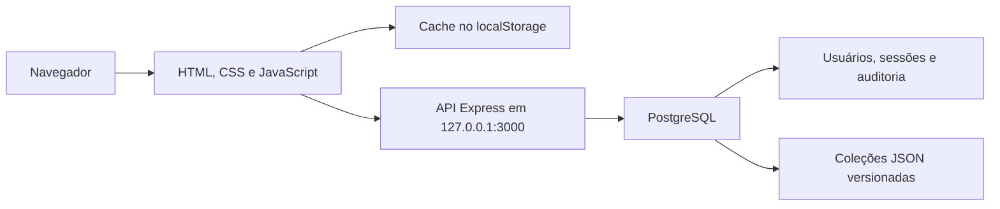
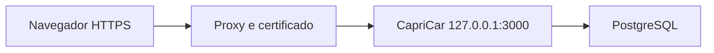

# CapriCar — Documentação Técnica e Operacional

Última revisão: 30/07/2026

Versão documentada: 1.0.0

## 1. Visão geral

O CapriCar é um sistema interno para gestão e reserva de veículos corporativos.
Ele centraliza:

- reservas de veículos por filial, data e horário;
- participação de passageiros em caronas;
- cadastro de filiais e veículos;
- bloqueios por manutenção, revisão, documentação ou indisponibilidade;
- retirada e devolução com quilometragem, combustível, fotos e avarias;
- usuários, perfis e permissões;
- regras configuráveis de reserva;
- auditoria das ações realizadas;
- relatórios em tela, CSV, Excel e PDF.

O sistema foi desenvolvido como uma aplicação web responsiva, com interface em
HTML, CSS e JavaScript, servidor Node.js/Express e banco PostgreSQL.

## 2. Tecnologias

| Camada | Tecnologia |
|---|---|
| Interface | HTML5, CSS3 e JavaScript sem framework |
| Servidor | Node.js e Express 5 |
| Banco de dados | PostgreSQL |
| Driver PostgreSQL | `pg` |
| Configuração | `dotenv` e arquivo `.env` |
| Autenticação | Cookie de sessão e senhas com `scrypt` |
| Testes | Test runner nativo do Node.js |
| Backup | `pg_dump` em formato customizado |
| Restauração | `pg_restore` |

Versão recomendada para uma nova instalação:

- Node.js 20 LTS ou superior;
- PostgreSQL 18 ou versão compatível;
- navegador moderno com JavaScript habilitado.

## 3. Funcionalidades

### 3.1 Reservas

- criação pelo formulário principal ou pelo calendário;
- edição pelo criador antes da retirada;
- cancelamento antes da retirada;
- filial, destino, veículo, período, horários, motivo e responsável;
- passageiros confirmados;
- somente horários compatíveis com reservas existentes;
- prevenção de conflito de veículo e horário;
- redirecionamento para “Minhas Reservas” após confirmar.

### 3.2 Minhas Reservas

- reservas ativas separadas do histórico;
- detalhes resumidos no cartão;
- motivo, responsável e solicitante em seção expansível;
- status confirmado, em uso ou concluído;
- ações conforme o estado da reserva;
- acesso direto para uma nova reserva.

Reservas concluídas não aparecem entre as ativas, não ocupam o calendário, não
bloqueiam novos horários e não contam no limite. Elas permanecem no histórico,
auditoria e relatórios.

### 3.3 Caronas

- visualização de reservas com lugares disponíveis;
- entrada e saída como passageiro;
- controle de capacidade por veículo;
- passageiro não pode cancelar ou editar a reserva do motorista.

### 3.4 Filiais e veículos

- cadastro, edição, ativação e desativação;
- identificação, placa, modelo e capacidade;
- exclusão definitiva de veículo com justificativa;
- preservação das reservas históricas e da auditoria;
- impedimento de exclusão quando existem reservas atuais ou futuras.

### 3.5 Bloqueios

Tipos previstos:

- manutenção;
- revisão/inspeção;
- documentação;
- indisponibilidade.

O bloqueio possui veículo, período, observações e responsável pela criação. Uma
reserva não pode ocupar um período bloqueado.

### 3.6 Retirada e devolução

Para cada etapa podem ser registrados:

- quilometragem;
- nível de combustível;
- avarias e observações;
- até três fotos de no máximo 1 MB cada;
- usuário responsável;
- data e hora efetivas.

A retirada somente pode ser registrada a partir da data e do horário agendados.
Após a retirada, os dados principais ficam bloqueados e somente a devolução pode
ser registrada. A quilometragem final não pode ser menor que a inicial.

### 3.7 Relatórios

Filtros:

- filial;
- veículo;
- período;
- usuário ou responsável.

Formatos:

- tela;
- CSV;
- Excel `.xlsx`;
- PDF por impressão formatada.

Os relatórios incluem período previsto, retirada e devolução efetivas,
quilometragem, combustível, avarias, ocupantes e status.

### 3.8 Auditoria

São registradas ações como criação, edição e cancelamento de reserva; entrada e
saída de carona; retirada e devolução; alterações cadastrais; exclusões;
mudanças de regras e exportações.

A auditoria fica em `audit_logs` e sua consulta completa é exclusiva do
administrador.

## 4. Perfis e permissões

| Recurso | Usuário comum | Facilities | Administrador |
|---|---:|---:|---:|
| Criar e consultar as próprias reservas | Sim | Sim | Sim |
| Entrar em caronas | Sim | Sim | Sim |
| Gerenciar reservas | Opcional | Sim | Sim |
| Gerenciar filiais e veículos | Opcional | Sim | Sim |
| Gerenciar bloqueios | Opcional | Sim | Sim |
| Consultar relatórios | Opcional | Sim | Sim |
| Alterar regras globais | Não | Não | Sim |
| Criar, editar e excluir usuários | Não | Não | Sim |
| Consultar auditoria completa | Não | Não | Sim |

Contas criadas pelo painel recebem o papel técnico `user` e podem ganhar
permissões individuais:

- `reservations`;
- `fleet`;
- `blocks`;
- `reports`.

A conta principal de administrador não pode ser desativada nem excluída.

## 5. Regras de negócio

| Regra | Valor padrão |
|---|---:|
| Duração máxima por reserva | 10 dias consecutivos |
| Antecedência máxima | 30 dias |
| Reservas ativas por usuário na janela | 2 |

O administrador pode alterar os valores no painel.

Outras regras:

- devolução igual ou posterior à retirada;
- no mesmo dia, devolução posterior à retirada;
- veículo e filial ativos;
- ocupantes dentro da capacidade;
- reservas concluídas ou canceladas não geram conflito;
- intervalos adjacentes são permitidos;
- reserva não pode cruzar bloqueio do veículo;
- criador não pode ser substituído;
- passageiro altera somente sua participação;
- reserva concluída não pode ser alterada.

## 6. Arquitetura



### 6.1 Interface

- `index.html`: estrutura das telas;
- `css/variables.css`: cores e medidas;
- `css/base.css`: tipografia, login e formulários;
- `css/components.css`: cabeçalho, cartões e reservas;
- `css/calendar.css`: calendário;
- `css/admin.css`: gestão administrativa;
- `css/responsive.css`: celulares e tablets.

Scripts:

- `js/config.js`: chaves e valores globais;
- `js/utils.js`: datas, conflitos e horários;
- `js/api.js`: API e sincronização;
- `js/storage.js`: coleções;
- `js/auth.js`: sessão, permissões e navegação;
- `js/reservations.js`: criação e listagem;
- `js/rides.js`: caronas;
- `js/calendar.js`: calendário principal;
- `js/modals.js`: reserva rápida e datas;
- `js/admin.js`: reservas administrativas;
- `js/management.js`: usuários, frota, operação e relatórios;
- `js/xlsx-export.js`: Excel;
- `js/app.js`: inicialização.

### 6.2 Servidor

O servidor atende em `127.0.0.1`, serve os arquivos da interface, expõe APIs,
aplica autenticação, valida novamente os dados, usa transações e controla
revisões para evitar sobrescrita simultânea.

Arquivos:

- `server/index.js`: aplicação Express;
- `server/config.js`: `.env`;
- `server/db.js`: pool e transações;
- `server/auth.js`: sessão e autorização;
- `server/security.js`: senhas e tokens;
- `server/validation.js`: validações;
- `server/routes/`: APIs;
- `server/scripts/`: migração, seed, backup e restauração.

### 6.3 Persistência atual

Tabelas relacionais usadas diretamente:

- `users`;
- `user_sessions`;
- `login_attempts`;
- `audit_logs`;
- `schema_migrations`.

Coleções operacionais em `application_state.value` como JSONB:

- `reservations`;
- `branches`;
- `vehicles`;
- `blocks`;
- `rules`.

Cada coleção tem uma `revision`. Se outra pessoa salvar antes, a API retorna
`409 STATE_CONFLICT` e a interface carrega a versão atual.

O banco também contém tabelas normalizadas de reservas, passageiros, operações
e bloqueios. Elas representam a estrutura planejada para uma evolução futura,
mas a interface atual usa `application_state` como fonte operacional. Portanto,
a tabela relacional `reservations` não deve ser tratada como a fonte das
reservas exibidas atualmente.

### 6.4 Cache local

As coleções ficam no `localStorage` para renderização rápida. Após o login,
`/api/state/bootstrap` carrega os dados do PostgreSQL. As alterações são
gravadas localmente e enfileiradas para a API.

O PostgreSQL é a fonte compartilhada. O `localStorage` não é backup.

## 7. Estrutura de diretórios

```text
capricar/
├── assets/                 Imagens da interface
├── backups/                Backups locais, fora do Git
├── css/                    Estilos
├── db/
│   ├── schema.sql          Estrutura inicial
│   └── migrations/         Migrações incrementais
├── docs/                   Documentação
├── js/                     Interface
├── server/
│   ├── routes/             APIs
│   └── scripts/            Migração, seed, backup e restore
├── tests/                  Testes
├── .env.example            Modelo de configuração
├── index.html              Página principal
├── package.json            Dependências e comandos
└── README.md               Início rápido
```

Não versionar:

- `.env`;
- `node_modules`;
- `backups`;
- `logs`;
- `tools`;
- `server/uploads`.

## 8. Instalação local

### 8.1 Banco e usuário

Conectado como `postgres`:

```sql
CREATE ROLE capricar_app
WITH LOGIN
PASSWORD 'ESCOLHA_UMA_SENHA_FORTE';

CREATE DATABASE capricar
OWNER capricar_app;
```

### 8.2 Ambiente

```powershell
Copy-Item .env.example .env
```

Configuração mínima:

```text
PORT=3000
NODE_ENV=development

PGHOST=localhost
PGPORT=5432
PGDATABASE=capricar
PGUSER=capricar_app
PGPASSWORD=SENHA_DO_POSTGRESQL

SESSION_TTL_HOURS=12
SESSION_COOKIE_SECURE=false

ADMIN_INITIAL_PASSWORD=SENHA_INICIAL_DO_ADMIN
FACILITIES_INITIAL_PASSWORD=SENHA_INICIAL_DO_FACILITIES

BACKUP_DIR=backups
BACKUP_RETENTION_DAYS=30
```

As senhas iniciais são usadas somente se as contas ainda não existirem.

### 8.3 Preparar e iniciar

```powershell
npm install
npm run db:migrate
npm run db:seed
npm start
```

Acesse `http://localhost:3000`.

Saúde: `http://localhost:3000/api/health`.

## 9. Variáveis de ambiente

| Variável | Obrigatória | Finalidade |
|---|---:|---|
| `PORT` | Não | Porta HTTP, padrão 3000 |
| `NODE_ENV` | Não | Ambiente |
| `PGHOST` | Sim | Host PostgreSQL |
| `PGPORT` | Não | Porta, padrão 5432 |
| `PGDATABASE` | Sim | Banco |
| `PGUSER` | Sim | Usuário |
| `PGPASSWORD` | Sim | Senha |
| `SESSION_TTL_HOURS` | Não | Duração da sessão |
| `SESSION_COOKIE_SECURE` | Não | `true` somente com HTTPS |
| `ADMIN_INITIAL_PASSWORD` | Primeira carga | Senha inicial admin |
| `FACILITIES_INITIAL_PASSWORD` | Primeira carga | Senha inicial Facilities |
| `BACKUP_DIR` | Não | Pasta de backup |
| `BACKUP_RETENTION_DAYS` | Não | Retenção local |
| `PG_DUMP_PATH` | Não | Caminho do `pg_dump` |
| `PG_RESTORE_PATH` | Não | Caminho do `pg_restore` |
| `BACKUP_ENCRYPTION_KEY` | Não | Se definida, cifra novos backups (AES-256-GCM) e remove o `.backup` em texto claro |

O `.env` real é secreto e não deve ser versionado nem colocado em ZIP público.

## 10. Comandos

| Comando | Finalidade |
|---|---|
| `npm start` | Iniciar servidor |
| `npm run dev` | Reinício automático |
| `npm run db:migrate` | Aplicar migrações |
| `npm run db:seed` | Criar dados iniciais |
| `npm run db:backup` | Criar backup |
| `npm run db:restore -- arquivo --confirm=capricar` | Restaurar |
| `npm test` | Testes locais |
| `npm run test:integration` | Testar API e banco |

## 11. API

### 11.1 Saúde e autenticação

| Método | Endpoint | Acesso |
|---|---|---|
| GET | `/api/health` | Público |
| POST | `/api/auth/login` | Público |
| POST | `/api/auth/logout` | Sessão atual |
| GET | `/api/auth/me` | Autenticado |

### 11.2 Usuários — administrador

| Método | Endpoint | Finalidade |
|---|---|---|
| GET | `/api/users` | Listar |
| POST | `/api/users` | Criar |
| PATCH | `/api/users/:id` | Alterar |
| DELETE | `/api/users/:id` | Exclusão lógica justificada |

### 11.3 Catálogo

| Método | Endpoint | Acesso |
|---|---|---|
| GET | `/api/catalog/branches` | Autenticado |
| GET | `/api/catalog/vehicles` | Autenticado |
| GET | `/api/catalog/reservation-rules` | Autenticado |

### 11.4 Estado operacional

| Método | Endpoint | Acesso |
|---|---|---|
| GET | `/api/state/bootstrap` | Autenticado |
| PUT | `/api/state/reservations` | Autenticado, com regras |
| PUT | `/api/state/branches` | Permissão `fleet` |
| PUT | `/api/state/vehicles` | Permissão `fleet` |
| PUT | `/api/state/blocks` | Permissão `blocks` |
| PUT | `/api/state/rules` | Administrador |
| DELETE | `/api/state/vehicles/:id` | Permissão `fleet` |
| POST | `/api/state/audit/event` | Autenticado |
| POST | `/api/state/audit/import` | Administrador |

Atualização de coleção:

```json
{
  "value": [],
  "revision": 12
}
```

## 12. Segurança

Implementado:

- senhas com `scrypt` e salt;
- comparação segura;
- token aleatório de 32 bytes;
- somente hash SHA-256 do token no banco;
- cookie `HttpOnly`, `SameSite=Lax` e `Secure` configurável;
- sessão com expiração e limite de dez sessões por usuário;
- bloqueio após oito falhas em quinze minutos por IP e usuário;
- validação de origem em operações de escrita;
- validação no backend;
- transações;
- controle otimista de revisão;
- Content Security Policy;
- proteção contra iframe e MIME sniffing;
- políticas de câmera, microfone e localização;
- erros 500 sem detalhes internos;
- remoção do cabeçalho `X-Powered-By`.

Para produção:

- HTTPS obrigatório;
- `NODE_ENV=production`;
- `SESSION_COOKIE_SECURE=true`;
- PostgreSQL restrito;
- senhas fortes;
- backup externo;
- proxy reverso;
- monitoramento de processo, banco, disco e certificado.

## 13. Backup e restauração

Criar:

```powershell
npm run db:backup
```

O backup customizado fica em `backups/`. A retenção padrão é 30 dias.

Se necessário:

```text
PG_DUMP_PATH=C:\Program Files\PostgreSQL\18\bin\pg_dump.exe
PG_RESTORE_PATH=C:\Program Files\PostgreSQL\18\bin\pg_restore.exe
```

Se `BACKUP_ENCRYPTION_KEY` estiver definida, o arquivo gerado é
`arquivo.backup.enc`. A mesma chave é obrigatória para restaurar.

Restaurar:

```powershell
npm run db:restore -- backups\arquivo.backup --confirm=capricar
```

Ou, para um backup cifrado:

```powershell
npm run db:restore -- backups\arquivo.backup.enc --confirm=capricar
```

A restauração limpa e substitui o banco configurado. Pare o CapriCar e crie um
backup do estado atual antes.

Política recomendada:

- backup diário;
- retenção local de 30 dias;
- cópia externa;
- teste mensal de restauração;
- backup antes de atualizações.

## 14. Testes

```powershell
npm test
```

A suíte cobre conflitos, adjacência, bloqueios, capacidade, regras de reserva,
permissões, segurança, validação, Excel, exclusão de veículos, histórico e
retirada antecipada.

Integração, com servidor ativo:

```powershell
$env:CAPRICAR_TEST_ADMIN_PASSWORD='SENHA_DO_ADMIN'
npm run test:integration
```

O teste cria registros temporários e executa limpeza. Não coloque a senha em
arquivos versionados.

## 15. Implantação com HTTPS

O Node escuta em `127.0.0.1:3000`. Em produção, publique por proxy reverso como
Caddy, Nginx ou IIS.



Checklist:

1. instalar Node.js e PostgreSQL;
2. criar usuário e banco;
3. copiar código sem o `.env` antigo;
4. configurar `.env`;
5. instalar dependências;
6. aplicar migrações;
7. restaurar backup ou executar seed;
8. configurar o processo como serviço;
9. configurar domínio e certificado;
10. ativar cookie seguro;
11. validar saúde, login e fluxos;
12. validar backup.

## 16. Operação e atualização

Diariamente:

- testar `/api/health`;
- conferir espaço em disco;
- verificar último backup;
- observar erros do serviço e PostgreSQL.

Antes de atualizar:

- criar backup;
- registrar versão;
- executar testes;
- validar reserva, retirada, devolução e relatório.

Em incidente:

- não apagar banco ou projeto;
- preservar logs e horário;
- verificar PostgreSQL, `.env` e serviço;
- restaurar somente após identificar o backup;
- documentar causa e ação.

## 17. Solução de problemas

### Login não funciona

Verifique Node, PostgreSQL, migrações, seed, conta ativa, senha e bloqueio
temporário por tentativas.

### `role "capricar_app" already exists`

O papel já existe:

```sql
ALTER ROLE capricar_app
WITH LOGIN
PASSWORD 'NOVA_SENHA';
```

Use a mesma senha em `PGPASSWORD`.

### `pg_dump` ou `pg_restore` não encontrado

Configure `PG_DUMP_PATH` e `PG_RESTORE_PATH`.

### Conflito de versão

Outra pessoa salvou antes. Atualize a página, confira os dados e repita.

### Interface desatualizada

Atualize a página, reabra o link no celular e confira os sufixos `?v=` em
`index.html`.

### Outro computador não acessa

O Node usa loopback. Publique por proxy, túnel temporário ou servidor. Não
exponha diretamente o PostgreSQL.

## 18. Limitações e evolução

Limitações:

- coleções operacionais são documentos JSON completos;
- fotos ficam na coleção como dados de imagem;
- backup é local por padrão;
- sem recuperação de senha por e-mail;
- sem MFA ou SSO;
- sem CI/CD;
- sem agendador de backup;
- PDF depende da impressão do navegador;
- tabelas normalizadas ainda não são a fonte principal.

Recomendações:

1. migrar operações para tabelas relacionais;
2. armazenar fotos em object storage;
3. criar CRUD por entidade;
4. implementar SSO e MFA;
5. automatizar backup externo;
6. adicionar monitoramento;
7. criar CI;
8. versionar releases e changelog;
9. criar ambiente de homologação.

## 19. Responsabilidades

| Responsabilidade | Papel recomendado |
|---|---|
| Usuários e permissões | Administrador |
| Frota e bloqueios | Facilities |
| PostgreSQL e backup | Infraestrutura/TI |
| HTTPS e proxy | Infraestrutura/TI |
| Atualizações | Desenvolvimento |
| Testes de negócio | Facilities e usuários-chave |
| Auditoria | Responsável designado |

## 20. Checklist de entrega

- código-fonte;
- `package.json` e arquivo de lock;
- `.env.example`, nunca `.env`;
- backup PostgreSQL validado;
- documentação;
- instruções de restauração;
- credenciais por canal seguro;
- versões de Node e PostgreSQL;
- endereço do ambiente;
- responsável técnico;
- resultado do último teste e backup.
